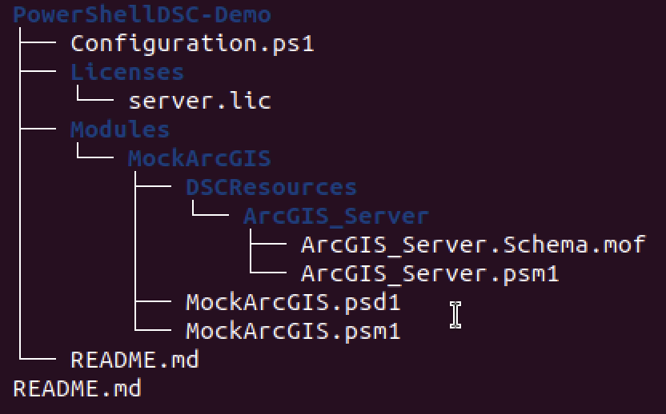
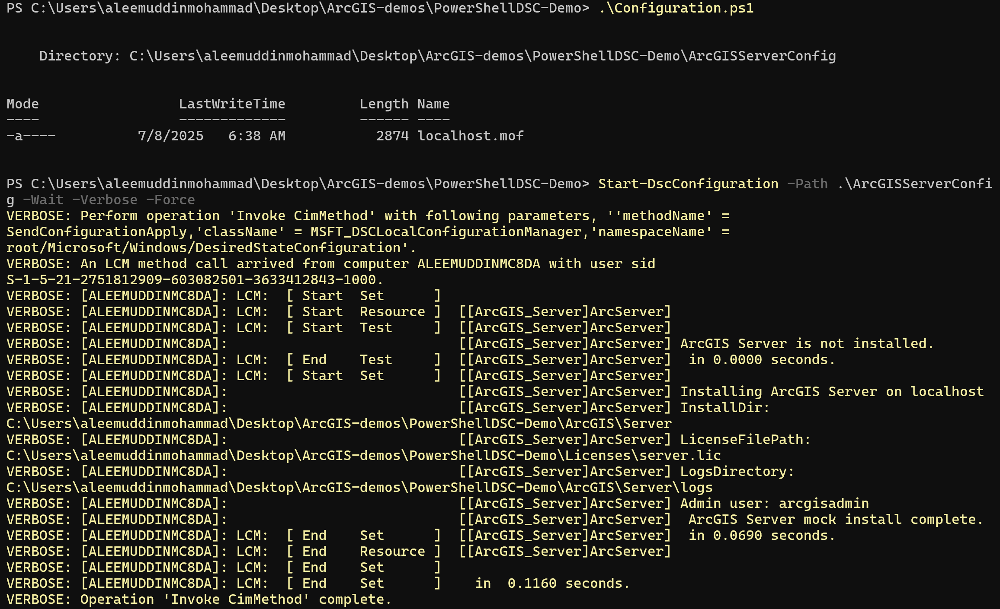
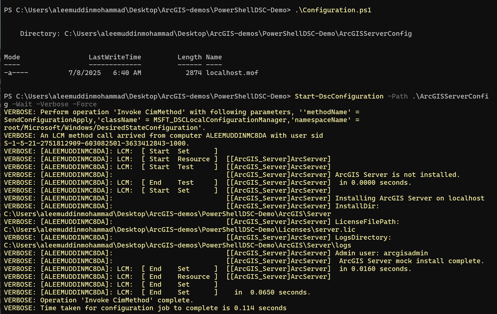

#  PowerShell DSC Demo for ArcGIS Server (Mock)

This demo simulates a **PowerShell DSC-based deployment** of ArcGIS Server on Windows — closely following Esri’s configuration automation practices.

The purpose of this project is to demonstrate:
- How configuration resources are authored (Get/Set/Test)
- How **idempotency** and **desired state enforcement** work in DSC
- A mock flow for installing ArcGIS Server (without actual binaries)

---

##  What This Demo Covers

-  Custom DSC resource (`ArcGIS_Server`)  
-  `Configuration.ps1` for local deployment  
-  Idempotency check via `Test-TargetResource`  
-  `install.log` simulation as a state marker  
-  Fully manual debug flow with intentional errors resolved

---

##  Directory Structure




---

##  What Gets Installed?

- **Folders** mimicking install/logs directories
- `install.log` containing timestamp and server details
- Created only if not already present (DSC idempotency)

 **Screenshot 1:** PowerShell terminal showing first-time `Start-DscConfiguration` run creating `install.log`
 


---

##  Idempotency Demonstration

The `Test-TargetResource` function checks whether the resource is already applied:

```powershell
if (Test-Path "$InstallDir\install.log") {
    return $true  # Resource is in desired state
}
```

This ensures `Set-TargetResource` runs only when needed.

 **Screenshot 2**: Second `Start-DscConfiguration` run showing no changes applied

 


Manually deleting logs and rerunning `Start-DscConfiguration` results in a fresh installation. In a production environment, this is automated

**Screenshot 3**: Third `Start-DscConfiguration` run showing fresh installation
 


---

##  Development Journey

###  Getting Started

I began with Esri’s PowerShell DSC repo, but to simplify:

- Created a mock resource `ArcGIS_Server`  
- Defined `Get/Set/Test` methods  
- Built `Configuration.ps1` to apply the resource locally  

---

###  Issues Faced

| Problem                             | How It Was Resolved                                         |
|-------------------------------------|--------------------------------------------------------------|
| `ArcGIS_Server` not recognized      | Module wasn’t placed correctly under `Modules/`             |
| Access Denied (`HRESULT 0x80338104`)| Ran PowerShell as administrator                             |
| Scripts disabled                    | Set execution policy: `Set-ExecutionPolicy RemoteSigned`    |
| `KeyParameterNotImplemented`        | Fixed by adding `NodeName` to `Get-TargetResource`          |


---

##  Final Output

Once completed, the following happened:

- `.mof` file generated under `ArcGISServerConfig/`
- `install.log` created if missing
- Re-running the script skipped the install logic as expected


---

##  Key Learnings

- How DSC modules are structured  
- How `Test-TargetResource` enables **idempotency**  
- How to simulate configuration logic without a real ArcGIS Server  
- How `Start-DscConfiguration` flows through compiled MOF logic  


# Open PowerShell as Administrator
cd PowerShellDSC-Demo
Import-Module ./Modules/MockArcGIS/MockArcGIS.psd1 -Force
.\Configuration.ps1
Start-DscConfiguration -Path .\ArcGISServerConfig -Wait -Verbose -Force


---

## 📎 References

- [PowerShell Desired State Configuration (DSC) - Microsoft Docs](https://learn.microsoft.com/en-us/powershell/dsc/overview)
- [Esri PowerShell DSC GitHub Repository](https://github.com/Esri/powerShell-DSC)

